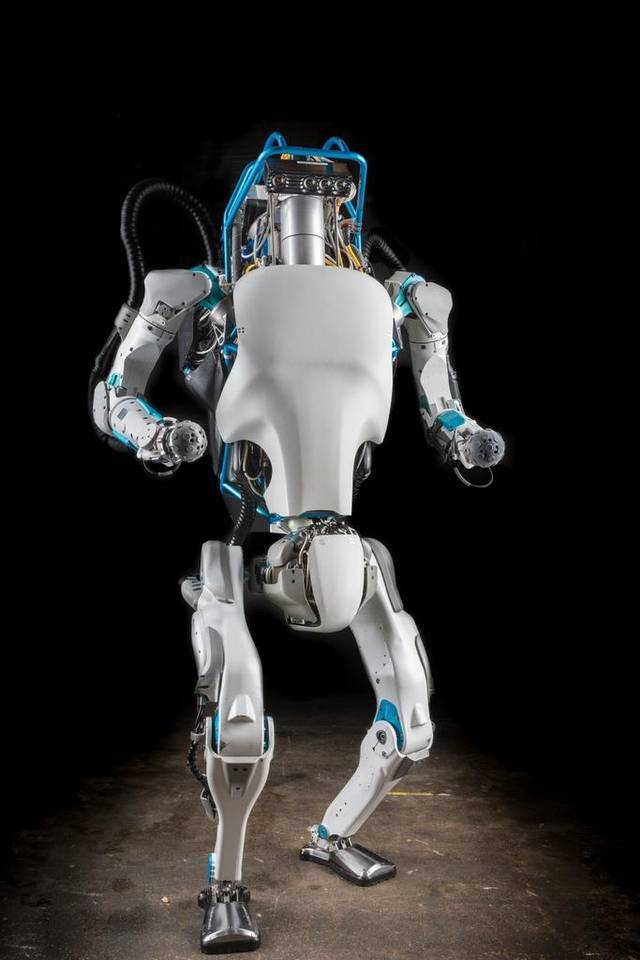
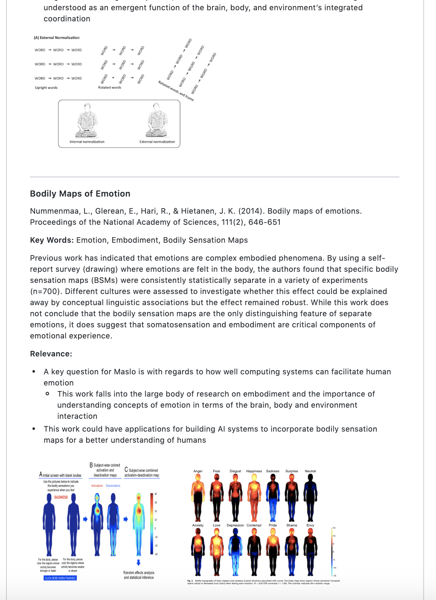

# Research in Progress

Progress on the research side during the week of 2/3/2020 - 2/7/2020.

## Items 
1. Lab Study Design
2. GitHub Repository 
3. Knob 
4. Tiana ML

## Lab Study Design 

##### Objective

Given the interesting relationship between exposure and agency perception found in the survey, we opted to assess how exposure influence mind perception in humans + robots in a lab setting. We will manipulate different levels of exposure and explore if longer exposure leads to higher ratings on agency and experience perception. 

##### Progress

We are currently completing the manuscript and the to-do's for getting the lab study ready to go, as well as selecting stimuli to be used for the experiment.

##### Sample Protagonists

<table class="tg">
  <tr>
    <td class="tg-0lax"></td>
    <td class="tg-0lax"></td>
    <td class="tg-0lax"></td>
  </tr>
  <tr>
    <td class="tg-0lax"></td>
    <td class="tg-0lax"></td>
    <td class="tg-0lax"></td>
  </tr>
  <tr>
    <td class="tg-0lax"></td>
    <td class="tg-0lax"></td>
    <td class="tg-0lax"></td>
  </tr>
</table>

## GitHub Repository 

##### Objective
Setup a GitHub repository containing all of our computational and cognitive research to showcase to a larger community of interested individuals.

##### Progress
  * Fundamental research repository (done, still private pending edits and reviews).
  * Computational research repository will include Orage, empathetic technology research on computational beings, and Tiana's ML (next week).

<table class="tg">
  <tr>
    <td class="tg-0lax"></td>
    <td class="tg-0lax"></td>
    <td class="tg-0lax"></td>
  </tr>
</table>

## Knob 

##### Objective

The idea is to put an AI between you and the media in order to let the machine manage your use of the media. One use case could be to give it to kids to expose them to healther content and ease them into technology with a healthier behavioral approach based on storytelling. You control your experience indirectly by teaching the machine and the machine remembers and will mimick your behaviour at corresponding times of the day. As you reinforce your habits, the knob will progressively gain its own weight, and build its own behaviour based on yours. As you let it live, recorded memories and behavioral traits fade out, and the knob can adapt to your new current use better. In short: you set the rules but you can fall under your own rules. I have conceptualize a whole interaction system to jump from one knob to another and also build your own knob and have the whole system cleaned-up for github so you can connect it to anything and build remembering machines. The whole thing also allows very easily to understand how and to hack the machine's behavioral map without coding but by literally painting your own behavioral map (with Paint or anything), which looks like this.

 
##### Progress
We're progressing on the knob prototype. 

<a href='https://drive.google.com/file/d/1GACC_bYePoRM4mXabpwQCjbeYJnTBTRJ/view'>This link takes you to a short video demo of Knob so far.</a>
 
## Tiana ML

**to be filled**
